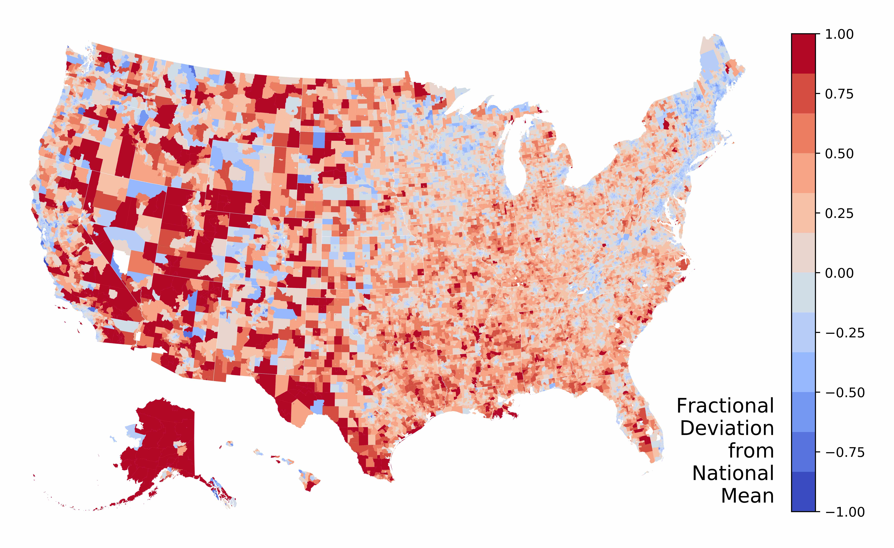

.. documentation master file

========================
Spatial Access for PySAL
========================

We are building this pysal package to calculate spatial accessibility from existing travel time matrices.

We have implemented traditional measures:

- FCAs (Huff 1963, :cite:`1963_huff_shopping_trade_areas`) along with others.
- 2SFCA (Luo and Wang, 2002, :cite:`2002_luo_spatial_accessibility_chicago`), 
- E2SFCA (Luo and Qi 2009, :cite:`2009_luo_qi_E2SFCA`),
- 3SFCA (Wan, Zou, and Sternberg, 2012, :cite:`2012_wan_3SFCA`), and our 
- Rational Agent Access Model (Saxon and Snow 2019, :cite:`2019_saxon_snow_raam`), 

.. raw:: html

   <figure class="figure">
     <embed src="https://saxon.harris.uchicago.edu/mmap/" style="padding: 10pt 0; width:95%; height: 70vh;">
     <figcaption class="figure-caption text-center">
       By distributing our calculation on Amazon Web Services,
         we are able to inexpensively compute an origin-destination driving time matrix
         for tracts within 100 km of each other.
       We also calculate transit time on public transportation, in 40 major cities.
       Explore the map by clicking around or entering an address.
       You can also download one-to-many data.
     </figcaption>
   </figure>

.. toctree::
   :hidden:
   :maxdepth: 3
   :caption: Contents:

   Installation <installation>
   API <api>
   References <references>

.. _PySAL: https://github.com/pysal/pysal
