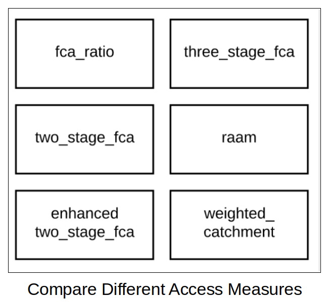
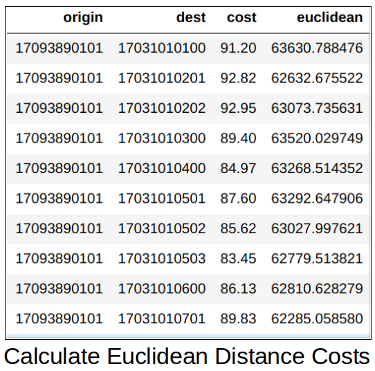
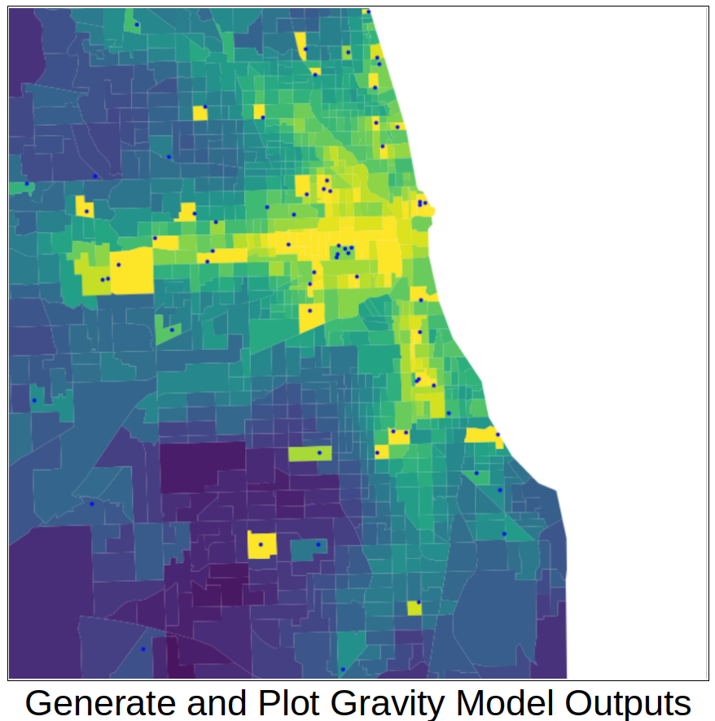
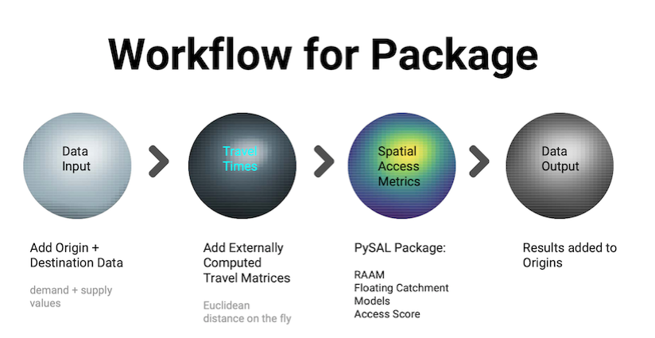

.. documentation master file

========================
Spatial Access for PySAL
========================

|

Whether you work with data in health, retail, employment or other domains, spatial accessibility measures help identify potential spatial mismatches between the supply and demand of services. They indicate how close demand locations are to supply locations.

^^^^^^^^^^^^^^^^^^^^^^^^^^^
Motivation
^^^^^^^^^^^^^^^^^^^^^^^^^^^

We built this package for several reasons:

- to make the new spatial access metric (RAAM) available,
- to allow for easy comparison between RAAM and classic spatial access models,
- to support spatial access research at scale by making pre-computed travel time matrices available and sharing code for computing new matrices at scale, and
- to allow users who prefer a point-and-click interface to obtain spatial access results for their data using our web app (for US).

^^^^^^^^^^^^^^^^^^^^^^^^^^^
Methods
^^^^^^^^^^^^^^^^^^^^^^^^^^^

This PySAL package implements our new measure that simultaneously accounts for travel time and congestion at the destination:

- `Rational Agent Access Model (RAAM) <https://access.readthedocs.io/en/latest/generated/access.raam.raam.html#access.raam.raam>`_ (Saxon and Snow 2019, :cite:`2019_saxon_snow_raam`).

Here is an example of the results of the RAAM model from this article: It shows how spatially accessible each Census tract is to primary care, compared to the national average. Darker blue areas have better spatial access (below-average travel costs) while darker red areas have worse spatial access (above average travel costs).

.. image:: _static/images/full_us.jpg
   :width: 100%

In addition, the package calculates five classic spatial access models within the same access class as RAAM for easy comparison between models. The methods implement the original published versions but also allow for additional customization (e.g. re. weights). 

- `Floating Catchment Areas <https://access.readthedocs.io/en/latest/generated/access.fca.fca_ratio.html#access.fca.fca_ratio>`_ (FCA): For each provider, this is the ratio of providers to clients within a given travel time to the provider (Huff 1963, :cite:`1963_huff_shopping_trade_areas`, Joseph and Bantock 1982, :cite:`1982_joseph_potential_physical_accessibility_rural` and Luo 2004, :cite:`2004_luo_gis_floating_catchment`).

- `Two-Step FCAs <https://access.readthedocs.io/en/latest/generated/access.fca.two_stage_fca.html#access.fca.two_stage_fca>`_ (2SFCA): Calculated in two steps for a given travel time to the provider: 1) for each provider, the provider-to-client ratio is generated, 2) for each point of origin, these ratios are then summed (Luo and Wang, 2002, :cite:`2002_luo_spatial_accessibility_chicago` and Wang and Luo 2005, :cite:`2004_wang_luo_HPSAs`).

- `Enhanced 2SFCA <https://access.readthedocs.io/en/latest/generated/access.fca.two_stage_fca.html#access.fca.two_stage_fca>`_ (E2SFCA): 2SFCA but with less weight to providers that are still within the travel threshold but at larger distances from the point of origin (Luo and Qi 2009, :cite:`2009_luo_qi_E2SFCA`).

- `Three-Step FCA <https://access.readthedocs.io/en/latest/generated/access.fca.three_stage_fca.html#access.fca.three_stage_fca>`_ (3SFCA): adds distance-based allocation function to E2SFCA (Wan, Zou, and Sternberg, 2012, :cite:`2012_wan_3SFCA`).

- `Access Score <https://access.readthedocs.io/en/latest/generated/access.fca.weighted_catchment.html#access.fca.weighted_catchment>`_: This is a weighted sum of access components like distance to provider and relative importance of provider type (Isard 1960, :cite:`1960_isard_reganalysis`).

These classic models were also recently implemented in the Python package `aceso <https://github.com/tetraptych/aceso>`_.

^^^^^^^^^^^^^^^^^^^^^^^^^^^
Architecture
^^^^^^^^^^^^^^^^^^^^^^^^^^^

Figure 1 shows the workflow that our PySAL package uses to calculate these models, including data inputs, creation of cost (travel time) matrix, and data output:

.. image:: _static/images/fig1.png
   :width: 100%

As shown, all measures depend on travel times or distances between origins and destinations. This is the most computationally expensive part of calculating spatial access measures. The `Cost Matrix <https://access.readthedocs.io/en/latest/resources.html>`_ section outlines how these travel times can be computed or how you can access our pre-computed matrices for the US.

Figure 2 shows the workflow from data input to data output. The most time-consuming and computationally intensive aspect of the workflow is the calculation of travel times (cost matrix).

|
^^^^^^^^^^^^^^^^^^^^^^^^^^^
Authors
^^^^^^^^^^^^^^^^^^^^^^^^^^^

- Spatial access package: `James Saxon, PhD <https://saxon.harris.uchicago.edu/>`_
- Research Assistants: `Yair Atlas <https://spatial.uchicago.edu/directories/full/2019-to-20>`_ (`CDAC Internship <https://cdac.uchicago.edu/engage/internships/>`_), `Bryan Wang <https://spatial.uchicago.edu/directories/full/2019-to-20>`_ and `Vidal Anguiano Jr., MSCAPP <https://www.linkedin.com/in/vidalanguiano/>`_
- Pre-Computed Cost Matrices: `Dan Snow, MPP <https://www.linkedin.com/in/dfsnow/>`_
- Concept and Documentation: `Julia Koschinsky, PhD <https://www.linkedin.com/in/julia-koschinsky-657599b1/>`_, `Karina Acosta Ordonez <https://aap.cornell.edu/academics/crp/graduate/planning/phd/student-profiles#science>`_, and `James Saxon, PhD <https://128.135.123.230/>`_
|

Citation: `Saxon, James, Julia Koschinsky, Karina Acosta, Vidal Anguiano, Luc Anselin, and Sergio Rey. (2020). An Open Software Environment to Make Spatial Access Metrics More Accessible. University of Chicago: Center for Spatial Data Science. Preprint doi:10.13140/RG.2.2.12396.28807 <https://www.researchgate.net/publication/350338824_An_Open_Software_Environment_to_Make_Spatial_Access_Metrics_More_Accessible>`_

.. toctree::
   :hidden:
   :maxdepth: 3
   :caption: Contents:

   Installation <installation>
   API <api>
   Tutorials <tutorials>
   Internal Access Functions <afunctions>
   Travel Times <resources>
   Live App <app>
   References <references>

.. _PySAL: https://github.com/pysal/pysal
